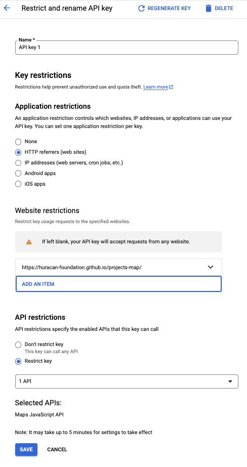

# projects-map

## Running locally

Prerequisites:

Use [`rbenv`](https://github.com/rbenv/rbenv#installation) to manage Ruby version locally.

Run `make` to install dependencies

Run `make local` to run Jekyll server

## Config

The public Google Maps API key can be found in `./config.yml` as `google_maps_api_key`. As this is a public API key, to prevent abuse, it should be restricted to the domain that the map is deployed to (`https://huracan-foundation.github.io/projects-map`) in addition to being restricted to the Google Maps API. This can be done in the Google Cloud console [Credentials](https://console.cloud.google.com/google/maps-apis/credentials?authuser=2) section for the Huracan project. See image below for reference.

    

Note: A separate API key should be created for local dev purposes where `127.0.0.1:4000` is whitelisted. This key should be shared privately and should never be commited to source control.

## Deployment

There is a GitHub action which builds the static site from src and commits it to the `github-pages` branch, wich is then deployed at [https://huracan-foundation.github.io/projects-map/](https://huracan-foundation.github.io/projects-map/). See `.github/workflows/github-pages.yml` for more.

## Build utils

See `./build-tools/README.md` for instructions on how to use the accompanying build scripts to re-generate location data
